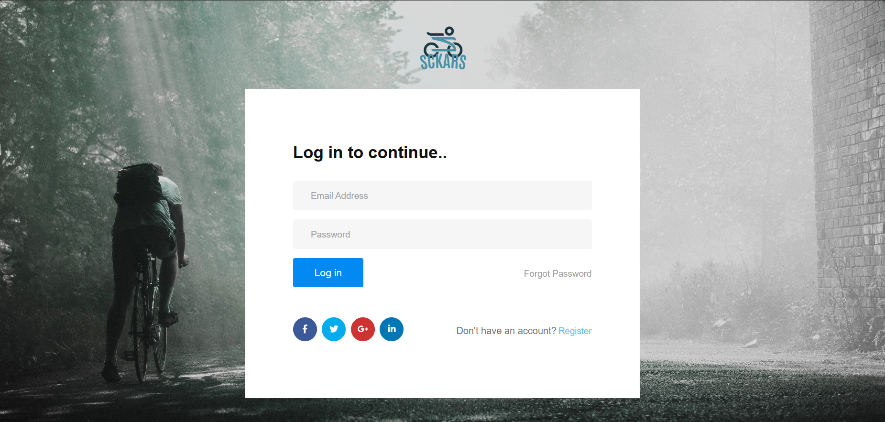
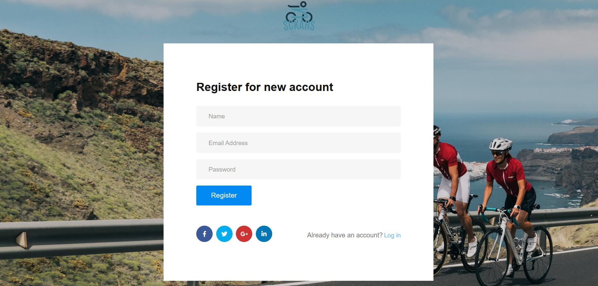

# SCKARS - Smart Cycle Kit and Rental System

SCKARS (Smart Cycle Kit and Rental System) is a comprehensive solution designed to revolutionize the way bicycles are rented and managed. It combines the power of IoT with a user-centric application and robust management software, all working in harmony to create a seamless cycle rental experience.

## Overview

SCKARS is not just a rental service; it's a fully integrated system that ensures users can rent and return bicycles with the utmost convenience. For operators, SCKARS offers an unparalleled level of fleet management and monitoring capabilities. This is enabled by our network of smart bicycles, each equipped with IoT sensors, and controlled via our centralized management platform.

## Features

- **IoT Enabled Bicycles**: Each bicycle in our fleet is fitted with sensors that provide real-time data on its status and location.

- **Centralized Management Platform**: A powerful backend system that allows for efficient management of the entire bicycle fleet.

- **User-Friendly Interface**: Both our web and mobile applications are designed with the user in mind, ensuring a hassle-free rental experience.

- **Integrated Payment System**: Simplifies the process of renting cycles and makes it possible to handle all transactions digitally.

## Technologies Used

- **Raspberry Pi Zero W**: For smart connectivity and IoT sensor integration.
- **HTML, CSS, JavaScript**: For crafting a responsive and interactive web application.
- **Flutter**: To build a cross-platform mobile application that delivers a consistent experience on both iOS and Android.
- **Django**: For a robust and scalable server-side platform.

## UI Screenshots

### Mobile Application(In Progress)

*Mobile App Home Screen showing nearby available bikes*

*Mobile App Booking Screen*

### Web Application(In Progress)

*Login Page*

*Registration Page*

